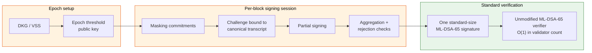

# lattice-aggregation

**Audit-oriented research scaffold for threshold post-quantum signature aggregation**

Interactive threshold aggregation for **ML-DSA-65** (NIST FIPS 204 / Dilithium) that aims to compress thousands of validator contributions into one standard-sized signature.

- Type-state protocol with deterministic transcripts
- Simulation backend with realistic ML-DSA-65-sized outputs
- Transparent hypothesis matrix, proof obligations, and release gates
- **Research stage**: publishable as a research artifact, not production cryptography

[Current Status](#current-status) • [Reproduce Evidence](#reproduce-evidence) • [Known Limitations](#known-limitations) • [Hypothesis Assessment](scripts/assess_lattice_hypothesis.py) • [Security Model](SECURITY.md) • [Claims Matrix](docs/cryptography/claims-matrix.md)


-7b3fe4)


## Grant & Collaboration

This repository is actively seeking research funding and cryptographic
collaboration to close the five tracked hypothesis criteria for interactive
threshold ML-DSA-65 signature aggregation. We are preparing submissions to
high-signal post-quantum and Ethereum-aligned funders (Ethereum Foundation ESP,
PQCA / Open Quantum Safe, Arbitrum, Rust Foundation, and academic cryptography
groups).

- **One-page executive summary:** [docs/grant/one-pager.md](docs/grant/one-pager.md)
- **Full grant proposal** (aims, novelty, risks, work plan, budget, evidence-vs-obligations): [docs/grant/proposal.md](docs/grant/proposal.md) ([package index](docs/grant/README.md))
- **Ethereum / post-quantum alignment:** [Alignment with Ethereum Post-Quantum Priorities](#alignment-with-ethereum-post-quantum-priorities)
- **What it takes to close the thesis:** [Path to Full Hypothesis Closure](#path-to-full-hypothesis-closure)
- **Outcome taxonomy:** [docs/cryptography/hypothesis-outcome-taxonomy.md](docs/cryptography/hypothesis-outcome-taxonomy.md)
- **Protocol flow & security boundaries:** [docs/assets/protocol-flow.md](docs/assets/protocol-flow.md)
- **Funding / sponsorship channels:** [.github/FUNDING.yml](.github/FUNDING.yml)
- **Maintainer & contact:** [AUTHORS.md](AUTHORS.md)

Reviewers from EF/ESP, PQCA/OQS, and academic cryptography teams are welcome.
The fastest path into the evidence package is the
[Reviewer Entry Points](#reviewer-entry-points) and the
[Cryptographic Claims Matrix](docs/cryptography/claims-matrix.md). We keep an
honest, audit-first boundary: this is a research-stage artifact, not a security
claim.

## Current Status

This repository is publishable as a research artifact and exploratory implementation. It is suitable as a technical whitepaper companion, audit-oriented prototype, and reproducible evidence scaffold for native threshold ML-DSA-65 aggregation research.

It is not publishable as production cryptography, a completed threshold ML-DSA construction, a FIPS/CAVP/ACVTS-validated implementation, or a finished standard-verifier-compatible aggregate signature scheme.

Current merged-main assessment status: `partially_proven`. The five tracked hypothesis criteria are all `partially_met`; none is currently classified as fully proven or disproven. The repository defines failure, partial success, and full success in [docs/cryptography/hypothesis-outcome-taxonomy.md](docs/cryptography/hypothesis-outcome-taxonomy.md).

## Reproduce Evidence

Use a clean target directory when reproducing evidence so local build artifacts do not mask stale state:

```sh
cargo fmt --all -- --check
python3 -m unittest script_tests.test_assess_lattice_hypothesis
python3 scripts/assess_lattice_hypothesis.py --out artifacts/hypothesis/latest --offline --target-dir /tmp/lattice-aggregation-publish-evidence
CARGO_NET_OFFLINE=true CARGO_TARGET_DIR=/tmp/lattice-aggregation-publish-evidence cargo test --features production-mldsa65-coordinator --test production_provider --test production_rejection_equivalence --test production_selected_backend --test proof_documentation_manifest
CARGO_NET_OFFLINE=true CARGO_TARGET_DIR=/tmp/lattice-aggregation-publish-evidence cargo test --features production-mldsa65-coordinator
```

These commands reproduce the current scaffold and documentation evidence. Passing them does not close the cryptographic theorem, select a production backend, or establish production ML-DSA security.

## Release Tag

`v0.1.0` remains the historical protocol-conformance tag. The next clean public research tag should be created only after this README status, hypothesis assessment, documentation manifest, and release-boundary wording are merged on `main`.

Recommended next tag name: `v0.2.0-research-preview`.

Tags must point at merged `main` commits, include the assessment output path used for reproduction, and avoid production-readiness language unless the [Release Readiness Checklist](docs/benchmarks/release-readiness-checklist.md) is fully satisfied.

**Readiness confirmation.** The repository is ready to cut
`v0.2.0-research-preview` once this work is merged to `main`. The
research-preview boundary is satisfied: the status, hypothesis assessment,
documentation manifest, and release-boundary wording are in place; the
[grant-readiness materials](docs/grant/one-pager.md) (one-pager, Ethereum/PQ
alignment, path-to-closure, funding, and authors) are added; and the
reproduction commands in [Reproduce Evidence](#reproduce-evidence) and
[Verification](#verification) pass with the assessment reporting
`partially_proven`. This tag remains a research-preview milestone only: it does
not assert proof closure, a selected production backend, or production
readiness. After the merge, create the tag from a clean tree on the merged
`main` commit:

```sh
git tag -a v0.2.0-research-preview -m "Research preview: grant-readiness package and proof-route documentation"
git push origin v0.2.0-research-preview
```

## The Problem

As L1 blockchains prepare for the post-quantum era, migration to NIST-standardized lattice-based cryptography such as FIPS 204 ML-DSA introduces a severe scalability tax. Unlike legacy BLS signature schemes, ML-DSA signatures do not natively compose or aggregate algebraically because of structured lattice secrets, masking vectors, and interactive rejection sampling.

Naively storing one ML-DSA signature per validator produces linear `O(N)` state and bandwidth growth. For large validator sets, that creates an unacceptable trade-off: cap validator participation to preserve performance, or accept network congestion and storage bloat to gain post-quantum security.

## The Proposed Framework

`lattice-aggregation` is a research scaffold for exploring a zero-compromise target: interactive threshold ML-DSA-65 signature aggregation.

The target architecture asks whether a large validator quorum can collectively generate a single, standard-sized ML-DSA-65 signature. If the required theorem obligations close, the verification path remains backward-compatible: an unmodified NIST-style verifier checks one signature under one epoch threshold public key, without needing to know that the signature was produced by a multi-party protocol.

To make that claim reviewable, the framework models an "Epsilon Residual Ledger" of five security boundaries that must be isolated before production cryptography can be claimed:

- transcript and Fiat-Shamir challenge binding across validator sets, sessions, and messages
- masking-vector and rejection-sampling residuals needed to match the single-signer distribution
- private-key-share isolation across DKG, partial signing, aggregation, and evidence paths
- selective-abort and liveness bias introduced by interactive participants
- byte-level verifier compatibility, domain separation, and standard ML-DSA-65 encoding constraints

### Protocol Flow and Security Boundaries

The diagram below shows the intended flow and marks where each Epsilon Residual
Ledger boundary lives. A larger standalone version with a per-boundary mapping
to the five hypothesis criteria and their evidence docs is in
[docs/assets/protocol-flow.md](docs/assets/protocol-flow.md); a rendered raster
version is [docs/assets/lattice-aggregation-protocol-flow.png](docs/assets/lattice-aggregation-protocol-flow.png).



The orange boundaries are the open security surfaces tracked by the
[Hypothesis Closure Requirements](#hypothesis-closure-requirements): private-key-share
isolation in setup; transcript/challenge binding and masking/rejection residuals
in signing; selective-abort bias across the signing rounds; and byte-level
verifier compatibility at the green verification boundary. The green boundary is
the backward-compatible path an unmodified verifier must accept. None of the
orange boundaries is yet closed; each is `partially_met`.

## Practical Implications Upon Theorem Closure

If the hypothesis is proven, implemented with a reviewed threshold backend, and validated against standard ML-DSA verification, the architecture would unlock several distributed-system benefits:

- **Validator scalability target (`O(1)` verification footprint).** Compresses the cryptographic proof of consensus for 10,000+ validators into a single approximately 3.3 KB ML-DSA-65 signature, decoupling verification and storage cost from validator count.
- **Zero-overhead quantum-resistance target.** Allows L1 blockchains to adopt post-quantum security without paying the normal lattice multi-signature penalty in network bandwidth and persistent state.
- **Backward-compatible verification path.** Lets light clients, cross-chain bridges, and hardware wallets verify post-quantum network consensus with off-the-shelf ML-DSA verification code rather than custom threshold-verifier modules.
- **Hyper-efficient interoperability target.** Replaces large multi-signature verification sets or expensive zero-knowledge wrappers with a single native ML-DSA verification check for bridge and cross-chain consensus proofs.

## Alignment with Ethereum Post-Quantum Priorities

Ethereum's post-quantum program (see [pq.ethereum.org](https://pq.ethereum.org))
and the broader "lean Ethereum" / lean-consensus roadmap have made
quantum-resistant validator signatures and their aggregation a first-order
research priority. The aggregation problem this repository studies sits squarely
inside that priority. The framing below positions the work for Ethereum
Foundation, ESP, and PQ-team reviewers; it states alignment and complementarity,
not endorsement, and preserves the repository's research-stage boundary.

**The aggregation bottleneck is shared.** A post-quantum validator set cannot
keep BLS's algebraic signature aggregation, so every PQ roadmap must answer the
same question this project asks: how do you turn many large lattice (or
hash-based) validator attestations into something a verifier can check cheaply?

- The Ethereum PQ roadmap treats signature size and aggregation as a central
  scaling concern for attestations and validator messages.
- ML-DSA-65 (FIPS 204) is a leading standardized lattice signature, which makes
  a native ML-DSA aggregation primitive directly relevant to any chain that
  adopts ML-DSA for validator signing.

**This is a complementary path, not a competitor.** The leading PQ aggregation
directions in the Ethereum ecosystem are hash-based signatures with SNARK
aggregation (e.g. the lean-consensus / `leanMultisig`-style approach that proves
a batch of hash-based signatures inside a succinct proof) and STARK/SNARK
recursion over attestations.

- **Hash-based + SNARK path:** aggregates by proving many signatures inside one
  succinct proof; the verifier checks a proof system, and proof generation cost
  and proving-stack trust assumptions dominate.
- **Interactive / threshold ML-DSA path (this work):** aggregates by running a
  multi-party signing protocol so the *output is itself a single standard
  ML-DSA-65 signature*; the verifier checks the standardized signature with no
  proof system in the verification path.
- These approaches trade off differently (prover cost and proof-stack trust
  versus interactive signing-round liveness and threshold assumptions), so a
  robust PQ roadmap benefits from evaluating both. A native-signature aggregator
  is a useful point of comparison and a potential fallback or hybrid component.

**O(1) verification footprint for large validator sets.** The design target is a
single standard-size (approximately 3.3 KB) ML-DSA-65 signature per block whose
verification cost is independent of the validator count.

- This matters most exactly where validator sets are largest and where light
  clients, bridges, and constrained verifiers are most sensitive to per-message
  verification cost.
- It avoids adding a SNARK/STARK verifier to the consensus-critical signature
  check, keeping the verifier surface equal to standardized ML-DSA-65.

**Backward-compatible standard verifier.** The construction is required to emit a
signature that an *unmodified* ML-DSA-65 verifier accepts against the epoch
threshold public key.

- No new verifier to standardize, audit, or re-implement across clients.
- Verification can reuse FIPS 204 ML-DSA-65 implementations and any future
  hardware acceleration, rather than depending on a fast-moving proving stack.

**Audit-first, transparent Rust methodology.** The repository is built for
review before it is built for claims, which matches how EF/PQ and OQS-adjacent
teams evaluate cryptographic infrastructure.

- The five tracked hypothesis criteria, the "Epsilon Residual Ledger" of
  security boundaries, and every non-claim are listed in the
  [Cryptographic Claims Matrix](docs/cryptography/claims-matrix.md), the
  [Hypothesis Closure Requirements](#hypothesis-closure-requirements), and the
  [thesis and operating parameters](docs/cryptography/thesis-operating-parameters.md).
- A reproducible assessment script (`scripts/assess_lattice_hypothesis.py`)
  reports a conservative `partially_proven` verdict, and production-labeled
  configurations fail closed against scaffold backends, so the code cannot
  present research machinery as production security.
- Fail-closed release gates, fixture-backed conformance evidence, and a
  documentation manifest test keep the engineering evidence independently
  re-runnable.

**Fit with validator attestation aggregation specifically.** The intended
integration model is epoch-keyed threshold signing over per-block attestations,
which is the same shape as the attestation-aggregation workload PQ roadmaps must
re-solve once BLS is retired.

- One epoch threshold public key replaces per-validator aggregate keys for the
  signature check.
- The aggregator role maps onto the existing proposer/aggregator responsibility
  rather than requiring a new privileged actor.

**Concrete next-step value for EF / PQ teams.** Funding or collaboration here
buys the ecosystem a rigorously bounded evaluation of the native-signature
aggregation option, with explicit deliverables:

- closure or explicit bounding of the five hypothesis criteria, giving reviewers
  a precise picture of what an interactive ML-DSA aggregator can and cannot
  guarantee;
- a written, apples-to-apples comparison against the hash-based + SNARK
  aggregation path on verification cost, signing-round liveness, trust
  assumptions, and audit surface;
- a reference Rust protocol specification and conformance suite that other PQ
  efforts can reuse or adversarially test;
- early identification of which assumptions (mask-distribution preservation,
  selective-abort bounds, malicious-secure DKG) are the true blockers for any
  native PQ signature aggregation primitive — information that is valuable to the
  roadmap even if the final answer is "prefer the SNARK path."

This positioning is deliberately conservative: the work is offered as a
well-instrumented research input to Ethereum's post-quantum signature
aggregation decision, not as a finished primitive.

## Why This Repo Exists

Threshold post-quantum signatures are not just a primitive swap. A credible validator integration has to make several boundaries explicit:

- which transcript fields are committed before the Fiat-Shamir challenge
- which validators contributed commitments and partial shares
- which malformed, duplicate, stale, or cross-session messages are rejected
- which state transitions are impossible by construction
- which networking, consensus, and timeout effects are outside the cryptographic core
- which claims are implemented today, simulated today, or still proof obligations

This repository turns those boundaries into Rust APIs, tests, wire types, actor scaffolding, and audit documentation.

## What Is Unique Here

- **Protocol-first threshold ML-DSA shape.** The crate focuses on the reviewer-visible boundary around threshold ML-DSA-65 instead of burying protocol assumptions inside an opaque backend.
- **Type-state signing sessions.** Session phases are encoded in the API so callers cannot aggregate before commitments, generate partials for invalid sessions, or skip validation paths accidentally.
- **Deterministic transcript binding.** Tests can assert stable session identifiers, challenge derivation, validator sets, commitments, and partial-share relationships without depending on live cryptographic randomness.
- **Production-shaped simulation outputs.** The simulation backend preserves ML-DSA-65-sized public keys and signatures, which keeps serialization, storage, adapter, and benchmark paths realistic while avoiding false production-security claims.
- **Audit packet plus proof crosswalks.** The docs map protocol phases to code, tests, trusted computing base assumptions, attack surface, side-channel boundaries, and open proof obligations.
- **Distributed-validator adapter boundary.** Async actor, P2P, consensus, evidence, and timeout traits show how a threshold signer could sit inside a larger validator stack without moving network effects into the core protocol model.

## Implemented Today

- `lattice-aggregation` package with Rust library name `lattice_aggregation`
- threshold signing session state machine in [src/protocol.rs](src/protocol.rs)
- backend trait and deterministic simulation backend in [src/backend.rs](src/backend.rs)
- partial-share aggregation boundary in [src/aggregation.rs](src/aggregation.rs)
- simulated DKG scaffold in [src/dkg.rs](src/dkg.rs)
- async actor, wire messages, consensus/P2P traits, and evidence types in [src/adapter/](src/adapter/)
- interpolation, verifiable-secret-sharing support, and polynomial experiments in [src/crypto/](src/crypto/) and [src/low_level/](src/low_level/)
- regression coverage for simulation flow, validation, transcript determinism, serialization, type-state compile failures, and documentation link integrity in [tests/](tests/)
- reviewer packet in [docs/audit/](docs/audit/) and cryptographic notes in [docs/cryptography/](docs/cryptography/)
- non-default `hazmat-real-mldsa` provider verification conformance, including a bounded NIST ACVP-Server FIPS204 ML-DSA-65 sigVer sample fixture; this is not threshold aggregate verification or validation evidence
- fixture-backed bridge conformance evidence for the P1 standard-verifier bridge package; this is not selected-backend aggregate output evidence
- selected-backend aggregate-output artifact gate for P1; conformance/proof-review evidence only, not selected-backend proof closure, not production, not CAVP/ACVTS or FIPS validation, and not a completed standard-verifier compatibility proof
- real standard-provider selected-backend aggregate-output package derivation for P1; this binds one provider-verified ML-DSA-65 candidate signature through `LocalAccept`, `AggregateAccept`, public recomputation, and bridge digest evidence, but it is not a real threshold aggregate signer or proof closure
- selected-backend threshold-output artifact gate for P1; this binds threshold-output source evidence to the aggregate artifact certificate, signer set, attempt, transcript, public recomputation, and bridge digests for proof review only
- selected-backend proof-closure artifact package gate for P1; this binds the accepted threshold-output certificate to reviewed proof artifacts, full KAT/validation artifact slots, rejection-distribution review, standard-verifier compatibility, and theorem-linkage artifact digest placeholders for proof review only
- real-threshold backend emission ingestion artifact for the 10,000-validator target; this binds external backend source, implementation, transcript, public key, message, and aggregate-signature digests into the threshold verifier closure contract, includes a provider-verified backend-output adapter for standard-verifier acceptance, rejects deterministic simulation and ordinary single-key standard-provider output as closure evidence, and remains conformance/proof-review evidence only
- checked real-threshold backend emission ingestion fixture harness for Criterion 2 at [tests/fixtures/p1_real_threshold_backend_emission_artifact_fixture.json](tests/fixtures/p1_real_threshold_backend_emission_artifact_fixture.json); this is classified as `FixtureHarness` and blocked from artifact readiness, not a real threshold backend implementation, not actual real threshold backend emission evidence, and not proof closure
- checked actual single-key ML-DSA-65 negative-control emission fixture at [tests/fixtures/p1_standard_provider_single_key_emission_artifact_fixture.json](tests/fixtures/p1_standard_provider_single_key_emission_artifact_fixture.json); this carries `ml-dsa`/`HazmatMldsa65Provider` source, implementation, transcript, accepted signature, and mutation-rejection evidence, but is rejected as `StandardProviderSingleKey` because it is not threshold backend provenance
- checked threshold-output certificate proof-slot fixture for Criterion 2 at [tests/fixtures/p1_threshold_output_certificate_artifact_fixture.json](tests/fixtures/p1_threshold_output_certificate_artifact_fixture.json); this is conformance/proof-review evidence only, not selected-backend proof closure, not production threshold ML-DSA security, not CAVP/ACVTS validation, not FIPS validation, not rejection-distribution preservation, and not a completed standard-verifier compatibility proof
- checked real recomputation proof-slot fixture for Criterion 2 at [tests/fixtures/p1_real_recomputation_artifact_fixture.json](tests/fixtures/p1_real_recomputation_artifact_fixture.json); this is conformance/proof-review evidence only, not selected-backend proof closure
- checked standard-verifier compatibility proof-slot fixture for Criterion 2 at [tests/fixtures/p1_standard_verifier_compatibility_artifact_fixture.json](tests/fixtures/p1_standard_verifier_compatibility_artifact_fixture.json); this is conformance/proof-review evidence only, not selected-backend proof closure, not production threshold ML-DSA security, and not a completed standard-verifier compatibility proof
- checked rejection-distribution review proof-slot fixture for Criterion 2 at [tests/fixtures/p1_rejection_distribution_review_artifact_fixture.json](tests/fixtures/p1_rejection_distribution_review_artifact_fixture.json); this is conformance/proof-review evidence only, not selected-backend proof closure, not production threshold ML-DSA security, not CAVP/ACVTS validation, not FIPS validation, not rejection-distribution preservation, and not a completed standard-verifier compatibility proof
- checked theorem-linkage proof-slot fixture for Criterion 2 at [tests/fixtures/p1_theorem_linkage_artifact_fixture.json](tests/fixtures/p1_theorem_linkage_artifact_fixture.json); this is conformance/proof-review evidence only, not selected-backend proof closure, not production threshold ML-DSA security, not CAVP/ACVTS validation, not FIPS validation, not rejection-distribution preservation, not completed standard-verifier compatibility, and not a completed cryptographic proof

## Explicit Non-Claims

This is not production cryptography.

The repository does not currently claim:

- production ML-DSA signing, threshold aggregate verification, or CAVP/ACVTS validation
- a production threshold ML-DSA construction
- a selected production backend, production release path, or completed standard-verifier compatibility proof
- side-channel resistance or constant-time production behavior
- audited distributed key generation
- FIPS validation
- consensus safety for production validator keys

The current security boundary is documented in [SECURITY.md](SECURITY.md), the [Cryptographic Claims Matrix](docs/cryptography/claims-matrix.md), and the [Release Readiness Checklist](docs/benchmarks/release-readiness-checklist.md).

## Known Limitations

- The native threshold ML-DSA security theorem is not closed.
- The selected-backend aggregate-output gate is conformance/proof-review evidence only.
- The selected-backend proof-closure artifact package gate is conformance/proof-review evidence only and is not selected-backend proof closure.
- The repository does not contain a reviewed production threshold backend.
- The bounded ACVP/FIPS204 fixture is provider-conformance evidence, not CAVP/ACVTS validation.
- The current benchmarks are deterministic simulation artifacts unless a document explicitly says otherwise.
- Side-channel resistance, constant-time production behavior, DKG hardening, consensus safety, and external audit sign-off remain release blockers.
- Falcon/LaBRADOR-style proof-wrapper aggregation is tracked as related work and a fallback architecture to evaluate, not the currently selected backend.

## Hypothesis Closure Requirements

The top-level hypothesis is only closed if a threshold ML-DSA-65 lattice aggregation protocol emits accepted aggregate outputs that behave like centralized ML-DSA-65 signatures under the same public key and message, while preserving threshold soundness, rejection-sampling distribution, contribution validity, leakage boundaries, and unforgeability reduction claims. The five requirements below are the closure criteria used by [scripts/assess_lattice_hypothesis.py](scripts/assess_lattice_hypothesis.py).

The criteria were chosen because they cover the minimum security surfaces that can break the claim: mask distribution, rejection equivalence, abort/retry bias, accepted partial contribution validity, and unauthorized aggregate unforgeability. Passing implementation tests alone is not enough; each row needs code evidence, proof artifacts, and claim-boundary documentation.

The formal thesis and operating-parameter contract is in [docs/cryptography/thesis-operating-parameters.md](docs/cryptography/thesis-operating-parameters.md), with machine-readable anchors in [docs/cryptography/thesis-operating-parameters.json](docs/cryptography/thesis-operating-parameters.json). Its thesis id is `native-threshold-mldsa65-aggregation-p1`; its scope is `research scaffold only`.

The outcome taxonomy is in [docs/cryptography/hypothesis-outcome-taxonomy.md](docs/cryptography/hypothesis-outcome-taxonomy.md). It defines failure, partial success, and full success for the top-level thesis and each criterion, including the rule that full hypothesis success is not production release readiness.

Criterion 1 proof substance is tracked in [docs/cryptography/criterion-1-proof-substance.md](docs/cryptography/criterion-1-proof-substance.md), with machine-readable anchors in [docs/cryptography/criterion-1-proof-substance.json](docs/cryptography/criterion-1-proof-substance.json). It formalizes the open proof payload for `aggregate_mask_distribution`, including selected mask construction, centralized and aggregate distribution artifacts, `renyi_bound_proof_digest`, min-entropy review, parameter selection, and external review slots marked `required_unclosed`; it does not promote Criterion 1 beyond `partially_met`.

Criterion 2 proof substance is tracked in [docs/cryptography/criterion-2-proof-substance.md](docs/cryptography/criterion-2-proof-substance.md), with machine-readable anchors in [docs/cryptography/criterion-2-proof-substance.json](docs/cryptography/criterion-2-proof-substance.json). It formalizes the open proof payload for `aggregate_rejection_equivalence`, including the checked threshold-output certificate, real recomputation, standard-verifier compatibility, rejection-distribution review, and theorem-linkage proof-slot fixtures; it does not promote Criterion 2 beyond `partially_met`.

Criterion 3 proof substance is tracked in [docs/cryptography/criterion-3-proof-substance.md](docs/cryptography/criterion-3-proof-substance.md), with machine-readable anchors in [docs/cryptography/criterion-3-proof-substance.json](docs/cryptography/criterion-3-proof-substance.json). It formalizes the open proof payload for `abort_retry_bias`, including `retry_domain_separation_proof_digest`, formal abort-leakage model, accepted-signature distribution proof, adversarial abort-policy corpus, sample-size bucket rationale, timeout/retry policy, and external review slots marked `required_unclosed`; it does not promote Criterion 3 beyond `partially_met`.

The 10,000-validator standard-verifier gate is tracked in [docs/cryptography/validator-10000-standard-verifier-gate.md](docs/cryptography/validator-10000-standard-verifier-gate.md) and enforced by `validator_10000_standard_verifier_gate`. It constructs a deterministic 10,000-validator topology with threshold 6,667, confirms the simulated aggregate is one standard-size 3,309-byte ML-DSA-65-shaped output, and confirms the current backend fails closed because `SimulatedBackend` cannot perform standard ML-DSA verification. Its status is `blocked_fail_closed`, not standard-verifier equivalence.

The real threshold backend emission ingestion artifact is tracked in the same 10,000-validator document and in [docs/cryptography/rejection-equivalence-evidence.md](docs/cryptography/rejection-equivalence-evidence.md). It defines the future input path for `P1RealThresholdBackendEmissionArtifactPackage` and the closure contract for `P1RealThresholdVerifierClosurePackage`: real threshold ML-DSA backend provenance, backend source package digest, backend implementation digest, backend transcript digest, 10,000 validators, threshold 6,667, a 3,309-byte aggregate signature, standard-verifier acceptance, and mutation rejection. The checked backend-output adapter `derive_p1_verified_real_threshold_backend_emission_artifact_package` verifies the submitted tuple through the standard-provider boundary before deriving the package, but it still requires external real-threshold backend material. The checked harness is blocked as `FixtureHarness`, and the actual single-key ML-DSA fixture is rejected as `StandardProviderSingleKey`; neither promotes Criterion 2 beyond `partially_met`.

Latest local assessment run:

```sh
python3 scripts/assess_lattice_hypothesis.py --out artifacts/hypothesis/latest --offline --target-dir /tmp/lattice-aggregation-p1-production-full
```

Latest verification commands:

```sh
cargo fmt --all -- --check
python3 -m unittest script_tests.test_assess_lattice_hypothesis
CARGO_NET_OFFLINE=true CARGO_TARGET_DIR=/tmp/lattice-aggregation-doc-gates cargo test --test proof_documentation_manifest --test thesis_operating_parameters_manifest --test criterion1_proof_substance_manifest --test criterion2_proof_substance_manifest --test criterion3_proof_substance_manifest --test validator_10000_standard_verifier_gate
CARGO_NET_OFFLINE=true CARGO_TARGET_DIR=/tmp/lattice-aggregation-p1-production-full cargo test --features production-mldsa65-coordinator --test production_provider --test production_rejection_equivalence --test production_selected_backend --test proof_documentation_manifest
CARGO_NET_OFFLINE=true CARGO_TARGET_DIR=/tmp/lattice-aggregation-p1-coordinator-full cargo test --features coordinator-assisted
CARGO_NET_OFFLINE=true CARGO_TARGET_DIR=/tmp/lattice-aggregation-p1-production-full cargo test --features production-mldsa65-coordinator
```

Latest result: all listed commands passed locally, the assessment command reported all five criteria as `partially_met`, and the overall hypothesis verdict was `partially_proven`. This is evidence of scaffold and conformance progress, not production cryptographic closure.

| Requirement | Why this requirement was chosen | Code and test evidence | Latest result | Determination |
| --- | --- | --- | --- | --- |
| Aggregate masks match or closely approximate centralized ML-DSA masks. | A threshold signer cannot be verifier-compatible if accepted aggregate masks come from a distinguishable distribution. | [src/production/mask_distribution.rs](src/production/mask_distribution.rs), [tests/production_mask_distribution.rs](tests/production_mask_distribution.rs), [docs/cryptography/mask-distribution-evidence.md](docs/cryptography/mask-distribution-evidence.md), [docs/cryptography/phase-1-noise-bound-model.md](docs/cryptography/phase-1-noise-bound-model.md). | Evidence gates and closure-package checks are present; Renyi-divergence evidence for `epsilon_mask` remains a release blocker. | Partially proven. |
| Aggregate rejection checks match centralized ML-DSA rejection checks. | ML-DSA security depends on rejection sampling; aggregate acceptance must match centralized rejection behavior rather than accepting threshold-only artifacts. | [src/production/rejection_equivalence.rs](src/production/rejection_equivalence.rs), [src/production/provider.rs](src/production/provider.rs), [tests/production_rejection_equivalence.rs](tests/production_rejection_equivalence.rs), [tests/production_provider.rs](tests/production_provider.rs), [tests/fixtures/acvp_mldsa65_sigver_fips204_sample.json](tests/fixtures/acvp_mldsa65_sigver_fips204_sample.json), [tests/fixtures/p1_standard_verifier_bridge_fixture.json](tests/fixtures/p1_standard_verifier_bridge_fixture.json), [tests/fixtures/p1_threshold_output_certificate_artifact_fixture.json](tests/fixtures/p1_threshold_output_certificate_artifact_fixture.json), [tests/fixtures/p1_real_recomputation_artifact_fixture.json](tests/fixtures/p1_real_recomputation_artifact_fixture.json), [tests/fixtures/p1_standard_verifier_compatibility_artifact_fixture.json](tests/fixtures/p1_standard_verifier_compatibility_artifact_fixture.json), [tests/fixtures/p1_real_threshold_backend_emission_artifact_fixture.json](tests/fixtures/p1_real_threshold_backend_emission_artifact_fixture.json), [tests/fixtures/p1_standard_provider_single_key_emission_artifact_fixture.json](tests/fixtures/p1_standard_provider_single_key_emission_artifact_fixture.json), [tests/fixtures/p1_rejection_distribution_review_artifact_fixture.json](tests/fixtures/p1_rejection_distribution_review_artifact_fixture.json), [tests/fixtures/p1_theorem_linkage_artifact_fixture.json](tests/fixtures/p1_theorem_linkage_artifact_fixture.json), [docs/cryptography/rejection-equivalence-evidence.md](docs/cryptography/rejection-equivalence-evidence.md). | P1 aggregate recomputation artifact gate, bounded ACVP/FIPS204 sample-vector provider conformance, a fixture-backed bridge evidence package with fixture-backed bridge conformance evidence, a selected-backend aggregate-output artifact gate, real standard-provider aggregate-output package evidence, a selected-backend threshold-output artifact gate, selected-backend proof-closure artifact package gate, and real-threshold backend emission ingestion artifact are present as stricter blocker-2/criterion-2 release gates. The real-threshold backend emission gate now distinguishes fixture harness input from actual threshold evidence: the checked harness is blocked as `FixtureHarness`, and actual single-key `ml-dsa` provider output is verified but rejected as `StandardProviderSingleKey`. The checked threshold-output certificate, real recomputation, standard-verifier compatibility, real-threshold backend emission ingestion, single-key negative-control, rejection-distribution review, and theorem-linkage fixtures are linked as conformance/proof-review evidence. These gates are necessary but not sufficient for criterion-2 promotion and remain conformance/proof-review evidence only; proof closure, actual real threshold backend emissions, full KAT coverage, reviewed proof artifacts, CAVP/ACVTS validation artifacts, rejection-distribution preservation, completed standard-verifier compatibility, and external review remain open. | Partially proven. |
| Selective aborts and retries do not bias accepted signatures. | Interactive threshold signing lets participants influence retries; accepted outputs must not be biased by abort timing or retry-domain reuse. | [src/production/abort_bias.rs](src/production/abort_bias.rs), [tests/production_abort_bias.rs](tests/production_abort_bias.rs), [docs/cryptography/abort-retry-bias-evidence.md](docs/cryptography/abort-retry-bias-evidence.md). | Retry-domain, leakage, accepted-sample, threshold, and review artifact gates are present; abort leakage and retry-bias distribution analysis remain proof obligations. | Partially proven. |
| Every accepted partial contribution is sound, context-bound, and hiding enough for the chosen leakage model. | A valid aggregate is meaningless if accepted partials can be stale, cross-context, malformed, or leaking beyond the chosen model. | [src/production/acceptance.rs](src/production/acceptance.rs), [src/production/partial_soundness.rs](src/production/partial_soundness.rs), [tests/production_acceptance.rs](tests/production_acceptance.rs), [tests/production_partial_soundness.rs](tests/production_partial_soundness.rs), [docs/cryptography/partial-soundness-evidence.md](docs/cryptography/partial-soundness-evidence.md). | Context-binding and proof-backed verifier gates are present; production local acceptance, partial verification, and hiding proof evidence are not complete. | Partially proven. |
| Every unauthorized accepting aggregate output reduces to a base ML-DSA forgery or a named threshold-side assumption violation. | The final security theorem must classify any accepting unauthorized output as either a base ML-DSA break or a precise threshold assumption failure. | [docs/cryptography/unauthorized-aggregate-reduction.md](docs/cryptography/unauthorized-aggregate-reduction.md), [tests/unauthorized_aggregate_reduction_manifest.rs](tests/unauthorized_aggregate_reduction_manifest.rs), [docs/cryptography/formal-security-theorem.md](docs/cryptography/formal-security-theorem.md), [docs/cryptography/proof-obligations.md](docs/cryptography/proof-obligations.md). | The reduction manifest names base-forgery and threshold-side cases and has classifier/simulator/review slots; the threshold unforgeability reduction remains a target, not a completed proof. | Partially proven. |

Current closure determination: `partially_proven`. None of the five requirements is disproven by the latest run, but none is fully proven until the missing proof/backend artifacts and validation evidence are checked in and reviewed.

### Path to Full Hypothesis Closure

Each of the five criteria above is currently `partially_met`. The table maps each
to one or two concrete next steps, a rough effort estimate, the key open proof
obligations, and the controlling evidence docs. Effort estimates are
planning-grade ranges for an experienced cryptographer, not commitments. All
five sit on top of the production setup obligation (malicious-secure DKG), which
is tracked separately in [vss-dkg-security-plan.md](docs/cryptography/vss-dkg-security-plan.md).

| # | Criterion (gate) | Concrete next steps | Effort | Open proof obligations | Controlling docs |
| --- | --- | --- | --- | --- | --- |
| 1 | Aggregate masks ≈ centralized ML-DSA masks (`mask_distribution` / `epsilon_mask`) | (a) select the production `CombineMask` / blinded pre-filter family; (b) supply the Renyi-divergence evidence bounding aggregate-vs-centralized mask distance | 3–6 months | `epsilon_mask` Renyi-divergence bound; no completed distance proof today | [criterion-1-proof-substance.md](docs/cryptography/criterion-1-proof-substance.md), [mask-distribution-evidence.md](docs/cryptography/mask-distribution-evidence.md), [phase-1-noise-bound-model.md](docs/cryptography/phase-1-noise-bound-model.md), [noise-rejection-proof-plan.md](docs/cryptography/noise-rejection-proof-plan.md) |
| 2 | Aggregate rejection = centralized rejection (`rejection_equivalence`) | (a) close the Criterion 2 proof payload (`aggregate_rejection_equivalence`) with real threshold recomputation; (b) complete standard-verifier compatibility evidence over the same candidate tuple | 2–4 months | real (not fixture) recomputation; completed standard-verifier compatibility proof | [rejection-equivalence-evidence.md](docs/cryptography/rejection-equivalence-evidence.md), [criterion-2-proof-substance.md](docs/cryptography/criterion-2-proof-substance.md) |
| 3 | Selective aborts / retries do not bias output (`abort_bias`) | (a) fix a concrete retry-domain and timeout policy; (b) prove an accepted-sample bound from the abort-leakage and retry-bias model | 3–5 months | abort-leakage analysis; retry-bias distribution bound | [criterion-3-proof-substance.md](docs/cryptography/criterion-3-proof-substance.md), [abort-retry-bias-evidence.md](docs/cryptography/abort-retry-bias-evidence.md), [active-adversary-model.md](docs/cryptography/active-adversary-model.md) |
| 4 | Partial contributions sound, bound, hiding (`partial_soundness`) | (a) specify production local-acceptance and partial-verification predicates; (b) prove soundness and hiding for the chosen leakage model | 6–12 months | production partial verification + hiding proof | [partial-soundness-evidence.md](docs/cryptography/partial-soundness-evidence.md), [vss-dkg-security-plan.md](docs/cryptography/vss-dkg-security-plan.md) |
| 5 | Every unauthorized output reduces to forgery/assumption | (a) complete the per-case reduction cases in the manifest; (b) close the threshold EUF-CMA reduction to base ML-DSA forgery or a named threshold assumption | 3–6 months | completed per-case reductions; threshold unforgeability reduction | [unauthorized-aggregate-reduction.md](docs/cryptography/unauthorized-aggregate-reduction.md), [formal-security-theorem.md](docs/cryptography/formal-security-theorem.md), [proof-obligations.md](docs/cryptography/proof-obligations.md) |

**External review needs.** Closure is not internal-only. Each criterion needs
independent cryptographic review of its evidence and any completed proof;
criteria 1–2 additionally need randomness and constant-time review of the
selected mask/rejection arithmetic ([side-channel-boundary.md](docs/cryptography/side-channel-boundary.md));
criterion 4 needs review of the chosen contribution/DKG backend's soundness and
hiding proofs; criterion 5 needs review that the reduction is total over the
production verifier grammar. Beyond the five, production deployment still
requires malicious-secure DKG, side-channel and leakage audit, FIPS/CAVP-style
validation, and an end-to-end external cryptographic review, as gated by the
[Release Readiness Checklist](docs/benchmarks/release-readiness-checklist.md) and
the [Audit Packet](docs/audit/README.md).

## Quick Start

```sh
cargo test
```

Run the included experiment harness:

```sh
cargo run
```

The harness prints LaTeX tables and PGFPlots-compatible CSV for simulated threshold signing sessions across small, mid-scale, and adversarial cluster profiles.

Run the bounded large-scale deterministic simulation profile:

```sh
cargo run -- --profile large --format csv --no-wall-sleep
```

Checked-in large-scale simulation artifacts are indexed in [Simulation Benchmark Results](docs/benchmarks/simulation-results.md). Future real-world benchmark claims must follow the [Real-World Benchmark Protocol](docs/benchmarks/real-world-benchmark-protocol.md) and remain blocked until a production threshold backend, external validator deployment, and reviewed artifacts exist.

Run the local validator-network orchestration smoke runner:

```sh
cargo run --example validator_localnet
```

The localnet runner is indexed in the [Local Validator-Network Runner](docs/benchmarks/localnet-validator-runner.md). It is local validator orchestration telemetry using the simulated backend only; it is not security evidence, real-world validator performance, or production-readiness evidence.

Local fault profiles such as `withheld-partial` are fault-injection telemetry
only. They can record incomplete local finalization, dropped in-memory message
deliveries, and local adapter evidence without making production network
liveness, consensus-safety, or Byzantine-fault-tolerance claims.

Quorum-participation packets can record `triggered_validator_count` when fewer
validators actively start signing than are registered. A passive validator is
not finalized and is not treated as slashing evidence.

Authenticated-transport packets can record a local `authentication_policy`,
accepted authenticated envelope count, and rejected envelope count. These
packets exercise a deterministic validator identity digest over the local
runner only; they are not production authenticated transport, peer discovery,
replay-resistance, or network-liveness evidence.

Authenticated-envelope-tamper packets are local tamper-rejection telemetry only.
They record a tampered authenticated envelope through `rejected_envelope_count`
without treating the local transport rejection as slashing evidence; this is
not production authenticated transport and not replay-resistance evidence.

## Verification

The CI workflow runs the same core checks reviewers should start with:

```sh
cargo fmt --all -- --check
cargo clippy --all-targets --all-features -- -D warnings
cargo test --all-features
```

The documentation manifest test also validates reviewer-facing documentation anchors and local markdown links:

```sh
cargo test --test proof_documentation_manifest --test thesis_operating_parameters_manifest --test criterion1_proof_substance_manifest --test criterion2_proof_substance_manifest --test criterion3_proof_substance_manifest --test validator_10000_standard_verifier_gate
```

## Reviewer Entry Points

- [Audit Packet](docs/audit/README.md): attack surface, trusted computing base, dependency assumptions, and high-priority review paths
- [Cryptographic Claims Matrix](docs/cryptography/claims-matrix.md): what is implemented, simulated, planned, or explicitly not claimed
- [Thesis and Operating Parameters](docs/cryptography/thesis-operating-parameters.md): current P1 thesis id, operating assumptions, promotion criteria, failure criteria, and fallback trigger
- [Hypothesis Outcome Taxonomy](docs/cryptography/hypothesis-outcome-taxonomy.md): definitions for failure, partial success, full success, and criterion promotion
- [Criterion 1 Proof Substance](docs/cryptography/criterion-1-proof-substance.md): open aggregate mask-distribution proof payload and required artifact slots
- [Criterion 2 Proof Substance](docs/cryptography/criterion-2-proof-substance.md): open aggregate rejection-equivalence proof payload and required artifact slots
- [Criterion 3 Proof Substance](docs/cryptography/criterion-3-proof-substance.md): open abort/retry-bias proof payload and required artifact slots
- [10,000 Validator Standard-Verifier Gate](docs/cryptography/validator-10000-standard-verifier-gate.md): fail-closed standard-verifier gate for the large validator profile; not equivalence evidence
- [Protocol Code Crosswalk](docs/cryptography/protocol-code-crosswalk.md): where each protocol phase lives in code and tests
- [Proof Implementation Crosswalk](docs/cryptography/proof-implementation-crosswalk.md): mapping from proof obligations to current implementation and test coverage
- [Formal Threshold ML-DSA Transcript](docs/cryptography/formal-threshold-mldsa-transcript.md): transcript fields, binding invariants, and stable anchors
- [Side-Channel and Constant-Time Boundary](docs/cryptography/side-channel-boundary.md): current leakage claims and production gate
- [Release Readiness Checklist](docs/benchmarks/release-readiness-checklist.md): gates before any production-readiness language
- [Simulation Benchmark Results](docs/benchmarks/simulation-results.md): checked-in deterministic large-scale simulation telemetry
- [Local Validator-Network Runner](docs/benchmarks/localnet-validator-runner.md): local multi-actor validator orchestration telemetry
- [Real-World Benchmark Protocol](docs/benchmarks/real-world-benchmark-protocol.md): required inputs before any real-world benchmark claim

## Repository Map

- [src/backend.rs](src/backend.rs): backend trait boundary and deterministic simulation backend
- [src/protocol.rs](src/protocol.rs): type-state signing session flow
- [src/aggregation.rs](src/aggregation.rs): partial-share aggregation interface
- [src/dkg.rs](src/dkg.rs): simulated distributed key generation scaffold
- [src/adapter/](src/adapter/): async actor, wire messages, consensus and P2P adapter traits, and evidence types
- [src/crypto/](src/crypto/): interpolation and verifiable-secret-sharing support code
- [src/low_level/](src/low_level/): polynomial primitives used by lower-level experiments
- [tests/](tests/): simulation, validation, transcript determinism, type-state, and low-level coverage
- [docs/audit/](docs/audit/): reviewer packet for attack surface and trusted computing base analysis
- [docs/cryptography/](docs/cryptography/): cryptographic notes, formal models, and proof-obligation crosswalks

## Design Boundaries

The repository separates protocol shape from cryptographic backend implementation:

- public APIs make transcript, validator set, threshold, commitment, and partial-share relationships explicit
- deterministic simulation lets tests assert stable behavior without relying on live cryptographic randomness
- type-state transitions prevent generating partials or aggregates from invalid session states
- adapter traits keep networking and consensus effects outside the core protocol model
- audit docs state what reviewers should trust, what is simulated, and what still needs production hardening

## Feature Gates

- `simulated` is enabled by default and provides deterministic protocol-test behavior.
- `hazmat` marks low-level experimental surfaces that should not be treated as stable production APIs.
- `hazmat-real-mldsa` enables an opt-in ML-DSA-65 provider bridge and bounded ACVP sample-vector conformance tests for ordinary signatures; it is not a production threshold backend.

## Roadmap Shape

Near-term production-threshold work should move through the documented gates:

- define the production backend boundary and domain-separated transcript contract
- replace deterministic signing output with externally reviewed threshold ML-DSA machinery
- add proof-carrying share validation, complaint/evidence handling, and DKG hardening
- add side-channel review, constant-time gates, and production benchmark artifacts
- require the [Release Readiness Checklist](docs/benchmarks/release-readiness-checklist.md) before production-readiness claims

## Suggested GitHub Topics

`rust`, `post-quantum`, `cryptography`, `threshold-signatures`, `ml-dsa`, `mldsa`, `dilithium`, `lattice-cryptography`, `distributed-systems`, `validator`, `consensus`, `protocol-engineering`, `security-audit`, `research`

## Contributing

Contributions should keep claims precise. If a change touches cryptographic behavior, transcript construction, validation logic, or wire formats, include tests and update the relevant audit notes.

See [CONTRIBUTING.md](CONTRIBUTING.md) and [SECURITY.md](SECURITY.md) before opening larger changes.
