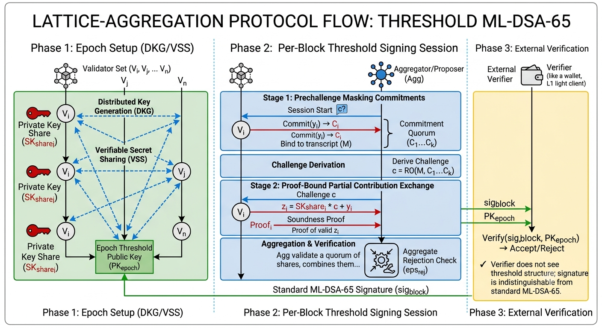

# lattice-aggregation

**Audit-oriented research scaffold for threshold post-quantum signature aggregation**

Interactive threshold aggregation for **ML-DSA-65** (NIST FIPS 204 / Dilithium) that aims to compress thousands of validator contributions into one standard-sized signature.

- Type-state protocol with deterministic transcripts
- Simulation backend with realistic ML-DSA-65-sized outputs
- Transparent hypothesis matrix, proof obligations, and release gates
- **Research stage**: publishable as a research artifact, not production cryptography

[Current Status](#current-status) • [Reproduce Evidence](#reproduce-evidence) • [Known Limitations](#known-limitations) • [Hypothesis Assessment](scripts/assess_lattice_hypothesis.py) • [Security Model](SECURITY.md) • [Claims Matrix](docs/cryptography/claims-matrix.md)




## Current Status

This repository is publishable as a research artifact and exploratory implementation. It is suitable as a technical whitepaper companion, audit-oriented prototype, and reproducible evidence scaffold for native threshold ML-DSA-65 aggregation research.

It is not publishable as production cryptography, a completed threshold ML-DSA construction, a FIPS/CAVP/ACVTS-validated implementation, or a finished standard-verifier-compatible aggregate signature scheme.

Current merged-main assessment status: `partially_proven`. The five tracked hypothesis criteria are all `partially_met`; none is currently classified as fully proven or disproven.

## Reproduce Evidence

Use a clean target directory when reproducing evidence so local build artifacts do not mask stale state:

```sh
cargo fmt --all -- --check
python3 -m unittest script_tests.test_assess_lattice_hypothesis
python3 scripts/assess_lattice_hypothesis.py --out artifacts/hypothesis/latest --offline --target-dir /tmp/lattice-aggregation-publish-evidence
CARGO_NET_OFFLINE=true CARGO_TARGET_DIR=/tmp/lattice-aggregation-publish-evidence cargo test --features production-mldsa65-coordinator --test production_provider --test production_rejection_equivalence --test production_selected_backend --test proof_documentation_manifest
CARGO_NET_OFFLINE=true CARGO_TARGET_DIR=/tmp/lattice-aggregation-publish-evidence cargo test --features production-mldsa65-coordinator
```

These commands reproduce the current scaffold and documentation evidence. Passing them does not close the cryptographic theorem, select a production backend, or establish production ML-DSA security.

## Release Tag

`v0.1.0` remains the historical protocol-conformance tag. The next clean public research tag should be created only after this README status, hypothesis assessment, documentation manifest, and release-boundary wording are merged on `main`.

Recommended next tag name: `v0.2.0-research-preview`.

Tags must point at merged `main` commits, include the assessment output path used for reproduction, and avoid production-readiness language unless the [Release Readiness Checklist](docs/benchmarks/release-readiness-checklist.md) is fully satisfied.

## The Problem

As L1 blockchains prepare for the post-quantum era, migration to NIST-standardized lattice-based cryptography such as FIPS 204 ML-DSA introduces a severe scalability tax. Unlike legacy BLS signature schemes, ML-DSA signatures do not natively compose or aggregate algebraically because of structured lattice secrets, masking vectors, and interactive rejection sampling.

Naively storing one ML-DSA signature per validator produces linear `O(N)` state and bandwidth growth. For large validator sets, that creates an unacceptable trade-off: cap validator participation to preserve performance, or accept network congestion and storage bloat to gain post-quantum security.

## The Proposed Framework

`lattice-aggregation` is a research scaffold for exploring a zero-compromise target: interactive threshold ML-DSA-65 signature aggregation.

The target architecture asks whether a large validator quorum can collectively generate a single, standard-sized ML-DSA-65 signature. If the required theorem obligations close, the verification path remains backward-compatible: an unmodified NIST-style verifier checks one signature under one epoch threshold public key, without needing to know that the signature was produced by a multi-party protocol.

To make that claim reviewable, the framework models an "Epsilon Residual Ledger" of five security boundaries that must be isolated before production cryptography can be claimed:

- transcript and Fiat-Shamir challenge binding across validator sets, sessions, and messages
- masking-vector and rejection-sampling residuals needed to match the single-signer distribution
- private-key-share isolation across DKG, partial signing, aggregation, and evidence paths
- selective-abort and liveness bias introduced by interactive participants
- byte-level verifier compatibility, domain separation, and standard ML-DSA-65 encoding constraints

## Practical Implications Upon Theorem Closure

If the hypothesis is proven, implemented with a reviewed threshold backend, and validated against standard ML-DSA verification, the architecture would unlock several distributed-system benefits:

- **Validator scalability target (`O(1)` verification footprint).** Compresses the cryptographic proof of consensus for 10,000+ validators into a single approximately 3.3 KB ML-DSA-65 signature, decoupling verification and storage cost from validator count.
- **Zero-overhead quantum-resistance target.** Allows L1 blockchains to adopt post-quantum security without paying the normal lattice multi-signature penalty in network bandwidth and persistent state.
- **Backward-compatible verification path.** Lets light clients, cross-chain bridges, and hardware wallets verify post-quantum network consensus with off-the-shelf ML-DSA verification code rather than custom threshold-verifier modules.
- **Hyper-efficient interoperability target.** Replaces large multi-signature verification sets or expensive zero-knowledge wrappers with a single native ML-DSA verification check for bridge and cross-chain consensus proofs.

## Why This Repo Exists

Threshold post-quantum signatures are not just a primitive swap. A credible validator integration has to make several boundaries explicit:

- which transcript fields are committed before the Fiat-Shamir challenge
- which validators contributed commitments and partial shares
- which malformed, duplicate, stale, or cross-session messages are rejected
- which state transitions are impossible by construction
- which networking, consensus, and timeout effects are outside the cryptographic core
- which claims are implemented today, simulated today, or still proof obligations

This repository turns those boundaries into Rust APIs, tests, wire types, actor scaffolding, and audit documentation.

## What Is Unique Here

- **Protocol-first threshold ML-DSA shape.** The crate focuses on the reviewer-visible boundary around threshold ML-DSA-65 instead of burying protocol assumptions inside an opaque backend.
- **Type-state signing sessions.** Session phases are encoded in the API so callers cannot aggregate before commitments, generate partials for invalid sessions, or skip validation paths accidentally.
- **Deterministic transcript binding.** Tests can assert stable session identifiers, challenge derivation, validator sets, commitments, and partial-share relationships without depending on live cryptographic randomness.
- **Production-shaped simulation outputs.** The simulation backend preserves ML-DSA-65-sized public keys and signatures, which keeps serialization, storage, adapter, and benchmark paths realistic while avoiding false production-security claims.
- **Audit packet plus proof crosswalks.** The docs map protocol phases to code, tests, trusted computing base assumptions, attack surface, side-channel boundaries, and open proof obligations.
- **Distributed-validator adapter boundary.** Async actor, P2P, consensus, evidence, and timeout traits show how a threshold signer could sit inside a larger validator stack without moving network effects into the core protocol model.

## Implemented Today

- `lattice-aggregation` package with Rust library name `lattice_aggregation`
- threshold signing session state machine in [src/protocol.rs](src/protocol.rs)
- backend trait and deterministic simulation backend in [src/backend.rs](src/backend.rs)
- partial-share aggregation boundary in [src/aggregation.rs](src/aggregation.rs)
- simulated DKG scaffold in [src/dkg.rs](src/dkg.rs)
- async actor, wire messages, consensus/P2P traits, and evidence types in [src/adapter/](src/adapter/)
- interpolation, verifiable-secret-sharing support, and polynomial experiments in [src/crypto/](src/crypto/) and [src/low_level/](src/low_level/)
- regression coverage for simulation flow, validation, transcript determinism, serialization, type-state compile failures, and documentation link integrity in [tests/](tests/)
- reviewer packet in [docs/audit/](docs/audit/) and cryptographic notes in [docs/cryptography/](docs/cryptography/)
- non-default `hazmat-real-mldsa` provider verification conformance, including a bounded NIST ACVP-Server FIPS204 ML-DSA-65 sigVer sample fixture; this is not threshold aggregate verification or validation evidence
- fixture-backed bridge conformance evidence for the P1 standard-verifier bridge package; this is not selected-backend aggregate output evidence
- selected-backend aggregate-output artifact gate for P1; conformance/proof-review evidence only, not selected-backend proof closure, not production, not CAVP/ACVTS or FIPS validation, and not a completed standard-verifier compatibility proof

## Explicit Non-Claims

This is not production cryptography.

The repository does not currently claim:

- production ML-DSA signing, threshold aggregate verification, or CAVP/ACVTS validation
- a production threshold ML-DSA construction
- a selected production backend, production release path, or completed standard-verifier compatibility proof
- side-channel resistance or constant-time production behavior
- audited distributed key generation
- FIPS validation
- consensus safety for production validator keys

The current security boundary is documented in [SECURITY.md](SECURITY.md), the [Cryptographic Claims Matrix](docs/cryptography/claims-matrix.md), and the [Release Readiness Checklist](docs/benchmarks/release-readiness-checklist.md).

## Known Limitations

- The native threshold ML-DSA security theorem is not closed.
- The selected-backend aggregate-output gate is conformance/proof-review evidence only.
- The repository does not contain a reviewed production threshold backend.
- The bounded ACVP/FIPS204 fixture is provider-conformance evidence, not CAVP/ACVTS validation.
- The current benchmarks are deterministic simulation artifacts unless a document explicitly says otherwise.
- Side-channel resistance, constant-time production behavior, DKG hardening, consensus safety, and external audit sign-off remain release blockers.
- Falcon/LaBRADOR-style proof-wrapper aggregation is tracked as related work and a fallback architecture to evaluate, not the currently selected backend.

## Hypothesis Closure Requirements

The top-level hypothesis is only closed if a threshold ML-DSA-65 lattice aggregation protocol emits accepted aggregate outputs that behave like centralized ML-DSA-65 signatures under the same public key and message, while preserving threshold soundness, rejection-sampling distribution, contribution validity, leakage boundaries, and unforgeability reduction claims. The five requirements below are the closure criteria used by [scripts/assess_lattice_hypothesis.py](scripts/assess_lattice_hypothesis.py).

The criteria were chosen because they cover the minimum security surfaces that can break the claim: mask distribution, rejection equivalence, abort/retry bias, accepted partial contribution validity, and unauthorized aggregate unforgeability. Passing implementation tests alone is not enough; each row needs code evidence, proof artifacts, and claim-boundary documentation.

Latest local assessment run:

```sh
python3 scripts/assess_lattice_hypothesis.py --out artifacts/hypothesis/latest --offline --target-dir /tmp/lattice-aggregation-p1-production-full
```

Latest verification commands:

```sh
cargo fmt --all -- --check
python3 -m unittest script_tests.test_assess_lattice_hypothesis
CARGO_NET_OFFLINE=true CARGO_TARGET_DIR=/tmp/lattice-aggregation-p1-production-full cargo test --features production-mldsa65-coordinator --test production_provider --test production_rejection_equivalence --test production_selected_backend --test proof_documentation_manifest
CARGO_NET_OFFLINE=true CARGO_TARGET_DIR=/tmp/lattice-aggregation-p1-coordinator-full cargo test --features coordinator-assisted
CARGO_NET_OFFLINE=true CARGO_TARGET_DIR=/tmp/lattice-aggregation-p1-production-full cargo test --features production-mldsa65-coordinator
```

Latest result: all listed commands passed locally, the assessment command reported all five criteria as `partially_met`, and the overall hypothesis verdict was `partially_proven`. This is evidence of scaffold and conformance progress, not production cryptographic closure.

| Requirement | Why this requirement was chosen | Code and test evidence | Latest result | Determination |
| --- | --- | --- | --- | --- |
| Aggregate masks match or closely approximate centralized ML-DSA masks. | A threshold signer cannot be verifier-compatible if accepted aggregate masks come from a distinguishable distribution. | [src/production/mask_distribution.rs](src/production/mask_distribution.rs), [tests/production_mask_distribution.rs](tests/production_mask_distribution.rs), [docs/cryptography/mask-distribution-evidence.md](docs/cryptography/mask-distribution-evidence.md), [docs/cryptography/phase-1-noise-bound-model.md](docs/cryptography/phase-1-noise-bound-model.md). | Evidence gates and closure-package checks are present; Renyi-divergence evidence for `epsilon_mask` remains a release blocker. | Partially proven. |
| Aggregate rejection checks match centralized ML-DSA rejection checks. | ML-DSA security depends on rejection sampling; aggregate acceptance must match centralized rejection behavior rather than accepting threshold-only artifacts. | [src/production/rejection_equivalence.rs](src/production/rejection_equivalence.rs), [src/production/provider.rs](src/production/provider.rs), [tests/production_rejection_equivalence.rs](tests/production_rejection_equivalence.rs), [tests/production_provider.rs](tests/production_provider.rs), [tests/fixtures/acvp_mldsa65_sigver_fips204_sample.json](tests/fixtures/acvp_mldsa65_sigver_fips204_sample.json), [tests/fixtures/p1_standard_verifier_bridge_fixture.json](tests/fixtures/p1_standard_verifier_bridge_fixture.json), [docs/cryptography/rejection-equivalence-evidence.md](docs/cryptography/rejection-equivalence-evidence.md). | P1 aggregate recomputation artifact gate, bounded ACVP/FIPS204 sample-vector provider conformance, a fixture-backed bridge evidence package with fixture-backed bridge conformance evidence, and a selected-backend aggregate-output artifact gate are present as stricter blocker-2/criterion-2 release gates. These gates are necessary but not sufficient for criterion-2 promotion and remain conformance/proof-review evidence only; real P1 recomputation proof artifacts, full KAT coverage, reviewed proof artifacts, CAVP/ACVTS validation artifacts, and external review remain open. | Partially proven. |
| Selective aborts and retries do not bias accepted signatures. | Interactive threshold signing lets participants influence retries; accepted outputs must not be biased by abort timing or retry-domain reuse. | [src/production/abort_bias.rs](src/production/abort_bias.rs), [tests/production_abort_bias.rs](tests/production_abort_bias.rs), [docs/cryptography/abort-retry-bias-evidence.md](docs/cryptography/abort-retry-bias-evidence.md). | Retry-domain, leakage, accepted-sample, threshold, and review artifact gates are present; abort leakage and retry-bias distribution analysis remain proof obligations. | Partially proven. |
| Every accepted partial contribution is sound, context-bound, and hiding enough for the chosen leakage model. | A valid aggregate is meaningless if accepted partials can be stale, cross-context, malformed, or leaking beyond the chosen model. | [src/production/acceptance.rs](src/production/acceptance.rs), [src/production/partial_soundness.rs](src/production/partial_soundness.rs), [tests/production_acceptance.rs](tests/production_acceptance.rs), [tests/production_partial_soundness.rs](tests/production_partial_soundness.rs), [docs/cryptography/partial-soundness-evidence.md](docs/cryptography/partial-soundness-evidence.md). | Context-binding and proof-backed verifier gates are present; production local acceptance, partial verification, and hiding proof evidence are not complete. | Partially proven. |
| Every unauthorized accepting aggregate output reduces to a base ML-DSA forgery or a named threshold-side assumption violation. | The final security theorem must classify any accepting unauthorized output as either a base ML-DSA break or a precise threshold assumption failure. | [docs/cryptography/unauthorized-aggregate-reduction.md](docs/cryptography/unauthorized-aggregate-reduction.md), [tests/unauthorized_aggregate_reduction_manifest.rs](tests/unauthorized_aggregate_reduction_manifest.rs), [docs/cryptography/formal-security-theorem.md](docs/cryptography/formal-security-theorem.md), [docs/cryptography/proof-obligations.md](docs/cryptography/proof-obligations.md). | The reduction manifest names base-forgery and threshold-side cases and has classifier/simulator/review slots; the threshold unforgeability reduction remains a target, not a completed proof. | Partially proven. |

Current closure determination: `partially_proven`. None of the five requirements is disproven by the latest run, but none is fully proven until the missing proof/backend artifacts and validation evidence are checked in and reviewed.

## Quick Start

```sh
cargo test
```

Run the included experiment harness:

```sh
cargo run
```

The harness prints LaTeX tables and PGFPlots-compatible CSV for simulated threshold signing sessions across small, mid-scale, and adversarial cluster profiles.

Run the bounded large-scale deterministic simulation profile:

```sh
cargo run -- --profile large --format csv --no-wall-sleep
```

Checked-in large-scale simulation artifacts are indexed in [Simulation Benchmark Results](docs/benchmarks/simulation-results.md). Future real-world benchmark claims must follow the [Real-World Benchmark Protocol](docs/benchmarks/real-world-benchmark-protocol.md) and remain blocked until a production threshold backend, external validator deployment, and reviewed artifacts exist.

## Verification

The CI workflow runs the same core checks reviewers should start with:

```sh
cargo fmt --all -- --check
cargo clippy --all-targets --all-features -- -D warnings
cargo test --all-features
```

The documentation manifest test also validates reviewer-facing documentation anchors and local markdown links:

```sh
cargo test --test proof_documentation_manifest
```

## Reviewer Entry Points

- [Audit Packet](docs/audit/README.md): attack surface, trusted computing base, dependency assumptions, and high-priority review paths
- [Cryptographic Claims Matrix](docs/cryptography/claims-matrix.md): what is implemented, simulated, planned, or explicitly not claimed
- [Protocol Code Crosswalk](docs/cryptography/protocol-code-crosswalk.md): where each protocol phase lives in code and tests
- [Proof Implementation Crosswalk](docs/cryptography/proof-implementation-crosswalk.md): mapping from proof obligations to current implementation and test coverage
- [Formal Threshold ML-DSA Transcript](docs/cryptography/formal-threshold-mldsa-transcript.md): transcript fields, binding invariants, and stable anchors
- [Side-Channel and Constant-Time Boundary](docs/cryptography/side-channel-boundary.md): current leakage claims and production gate
- [Release Readiness Checklist](docs/benchmarks/release-readiness-checklist.md): gates before any production-readiness language
- [Simulation Benchmark Results](docs/benchmarks/simulation-results.md): checked-in deterministic large-scale simulation telemetry
- [Real-World Benchmark Protocol](docs/benchmarks/real-world-benchmark-protocol.md): required inputs before any real-world benchmark claim

## Repository Map

- [src/backend.rs](src/backend.rs): backend trait boundary and deterministic simulation backend
- [src/protocol.rs](src/protocol.rs): type-state signing session flow
- [src/aggregation.rs](src/aggregation.rs): partial-share aggregation interface
- [src/dkg.rs](src/dkg.rs): simulated distributed key generation scaffold
- [src/adapter/](src/adapter/): async actor, wire messages, consensus and P2P adapter traits, and evidence types
- [src/crypto/](src/crypto/): interpolation and verifiable-secret-sharing support code
- [src/low_level/](src/low_level/): polynomial primitives used by lower-level experiments
- [tests/](tests/): simulation, validation, transcript determinism, type-state, and low-level coverage
- [docs/audit/](docs/audit/): reviewer packet for attack surface and trusted computing base analysis
- [docs/cryptography/](docs/cryptography/): cryptographic notes, formal models, and proof-obligation crosswalks

## Design Boundaries

The repository separates protocol shape from cryptographic backend implementation:

- public APIs make transcript, validator set, threshold, commitment, and partial-share relationships explicit
- deterministic simulation lets tests assert stable behavior without relying on live cryptographic randomness
- type-state transitions prevent generating partials or aggregates from invalid session states
- adapter traits keep networking and consensus effects outside the core protocol model
- audit docs state what reviewers should trust, what is simulated, and what still needs production hardening

## Feature Gates

- `simulated` is enabled by default and provides deterministic protocol-test behavior.
- `hazmat` marks low-level experimental surfaces that should not be treated as stable production APIs.
- `hazmat-real-mldsa` enables an opt-in ML-DSA-65 provider bridge and bounded ACVP sample-vector conformance tests for ordinary signatures; it is not a production threshold backend.

## Roadmap Shape

Near-term production-threshold work should move through the documented gates:

- define the production backend boundary and domain-separated transcript contract
- replace deterministic signing output with externally reviewed threshold ML-DSA machinery
- add proof-carrying share validation, complaint/evidence handling, and DKG hardening
- add side-channel review, constant-time gates, and production benchmark artifacts
- require the [Release Readiness Checklist](docs/benchmarks/release-readiness-checklist.md) before production-readiness claims

## Suggested GitHub Topics

`rust`, `post-quantum`, `cryptography`, `threshold-signatures`, `ml-dsa`, `mldsa`, `dilithium`, `lattice-cryptography`, `distributed-systems`, `validator`, `consensus`, `protocol-engineering`, `security-audit`, `research`

## Contributing

Contributions should keep claims precise. If a change touches cryptographic behavior, transcript construction, validation logic, or wire formats, include tests and update the relevant audit notes.

See [CONTRIBUTING.md](CONTRIBUTING.md) and [SECURITY.md](SECURITY.md) before opening larger changes.
