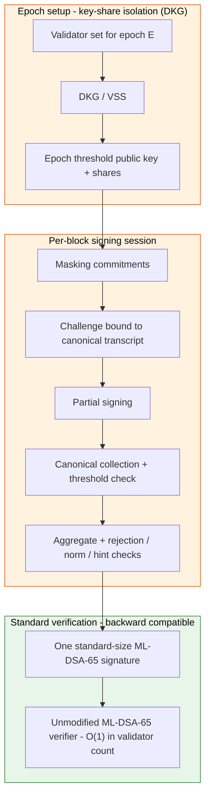

# Protocol Flow and Security Boundaries

This diagram shows the intended threshold ML-DSA-65 aggregation flow and marks
where the open security boundaries live. It is a design and review aid, not a
claim that any boundary is closed. The orange boundaries correspond to the
"Epsilon Residual Ledger" tracked in the
[Cryptographic Claims Matrix](../cryptography/claims-matrix.md); the green
boundary is the backward-compatible verification path the construction must
preserve. A rendered raster version of the same flow is in
[lattice-aggregation-protocol-flow.png](lattice-aggregation-protocol-flow.png).

## End-to-end flow

## Security boundaries mapped to closure criteria

| Boundary (Epsilon Residual Ledger) | Stage | Closure criterion / gate | Current status | Controlling docs |
| --- | --- | --- | --- | --- |
| Private-key-share isolation across DKG, partial signing, aggregation, evidence | Epoch setup → signing | Partial contribution soundness (`partial_soundness`); production DKG | `partially_met`; malicious-secure DKG open | [partial-soundness-evidence.md](../cryptography/partial-soundness-evidence.md), [vss-dkg-security-plan.md](../cryptography/vss-dkg-security-plan.md) |
| Transcript and Fiat-Shamir challenge binding | Commitment → challenge | Underpins all criteria; transcript binding invariants | Deterministic-binding tests; formal proof open | [formal-threshold-mldsa-transcript.md](../cryptography/formal-threshold-mldsa-transcript.md), [random-oracle-game.md](../cryptography/random-oracle-game.md) |
| Masking-vector and rejection-sampling residuals | Partial signing → aggregation | Mask distribution (`mask_distribution`); rejection equivalence (`rejection_equivalence`) | `partially_met`; `epsilon_mask` Renyi bound open | [mask-distribution-evidence.md](../cryptography/mask-distribution-evidence.md), [rejection-equivalence-evidence.md](../cryptography/rejection-equivalence-evidence.md), [criterion-2-proof-substance.md](../cryptography/criterion-2-proof-substance.md) |
| Selective-abort and liveness bias | Signing rounds | Abort/retry bias (`abort_bias`) | `partially_met`; abort-leakage / retry-bias bound open | [abort-retry-bias-evidence.md](../cryptography/abort-retry-bias-evidence.md), [active-adversary-model.md](../cryptography/active-adversary-model.md) |
| Byte-level verifier compatibility, domain separation, encoding | Standard verification | Unauthorized-output reduction; standard-verifier compatibility | `partially_met`; threshold EUF-CMA reduction open | [unauthorized-aggregate-reduction.md](../cryptography/unauthorized-aggregate-reduction.md), [formal-security-theorem.md](../cryptography/formal-security-theorem.md), [proof-obligations.md](../cryptography/proof-obligations.md) |

None of these boundaries is claimed closed in the current repository. The latest
hypothesis assessment reports `partially_proven` with every criterion
`partially_met`. Malicious-secure DKG is a standing precondition that sits
underneath all five criteria rather than being one of them; it is tracked
separately in [vss-dkg-security-plan.md](../cryptography/vss-dkg-security-plan.md)
(also linked in the table above). Production deployment additionally requires
that DKG realization, side-channel and leakage audit, validation evidence, and
external cryptographic review, as gated by the
[Release Readiness Checklist](../benchmarks/release-readiness-checklist.md).
